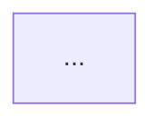

# Infrastructure diagram from IaC

Read a repo's infrastructure-as-code and write a Mermaid architecture diagram to
`docs/architecture.md`. Cloud-agnostic and IaC-flavour-agnostic — detect what is present, then map it.

`$ARGUMENTS`, if given, narrows the scope to that subdirectory or layer. Otherwise scan the repo root.

## 1. Detect the IaC flavours present

Glob the repo (skip `.git`, `node_modules`, `.terraform`, `vendor`, `.claude/worktrees`):

| Glob | Flavour |
|---|---|
| `**/*.tf` | Terraform |
| `**/helmfile.yaml`, `**/helmfile.d/*.yaml` | helmfile |
| `**/Chart.yaml` | Helm chart |
| `**/*.y*ml` containing `apiVersion:` + `kind:` | raw k8s manifests |
| `**/docker-compose*.y*ml` | docker-compose |
| `**/*.bicep`, `**/azuredeploy.json` | Bicep / ARM |

More than one is normal — a repo often has Terraform *and* helmfile. Diagram **each layer
separately** (§6), not merged: they change at different cadences and have different reviewers.

If nothing is detected, say so and stop. Do not invent a diagram.

## 2. Extract per flavour

**Terraform** — read every `*.tf` in scope. Collect `resource` and `data` blocks (type + name),
`module` blocks and their `source`, explicit `depends_on`, and implicit edges from interpolation
references (`azurerm_x.y.id` inside another resource ⇒ edge). Read `variables.tf` and any
`*.tfvars` / `*.auto.tfvars` to resolve real names, SKUs and counts. If workspaces are in use
(`terraform.workspace` in the HCL, or a `README` describing a branch↔workspace mapping), note which
environment the values belong to and say so in the output.

**helmfile** — read `releases[]`: name, chart, version, namespace, `values:` file paths. Read each
referenced `values/**` file for the wiring that matters (ingress hosts, service names, replica
counts, dependencies on other releases). Where a helmfile has `environments:`, show the per-env
overlay as a note rather than duplicating the whole graph.

**Helm chart** — `Chart.yaml` for name/version/dependencies; `templates/` for Deployments,
StatefulSets, Services, Ingress; `values.yaml` for defaults.

**Raw k8s manifests** — Deployments/StatefulSets/DaemonSets as compute, Services and Ingress as
network, PVCs/ConfigMaps as data, Secrets and ExternalSecrets as security.

**docker-compose** — `services` as nodes, `depends_on` and shared `networks` as edges, `volumes` as
data.

**Bicep / ARM** — resource declarations and `dependsOn`.

## 3. Group into subgraphs

Default grouping is **by function**, which reads far better than by file:

- **Network** — ingress, load balancers, DNS, VNets/subnets, private endpoints, service mesh
- **Compute** — clusters, node pools, workloads, functions, container apps
- **Data** — SQL/NoSQL databases, caches, object storage, queues, volumes
- **Security** — secret stores, identities, RBAC bindings, certificates
- **Monitoring** — metrics, logs, traces, dashboards, alert rules

Fall back to grouping by Terraform module, or by k8s namespace, when function is genuinely ambiguous.
Omit a subgraph entirely rather than emitting it empty.

**Always draw the secrets pipeline explicitly** where one exists — it is usually the least obvious
part of a platform and the thing newcomers get wrong. Trace it end to end across layers, e.g.
Terraform → Azure Key Vault → External Secrets Operator → native k8s Secret → workload.

## 4. Mermaid rules (draw.io + Excalidraw compatibility)

The output has to survive import into both editors, which constrains the syntax:

- Use **`flowchart TB`** (or `LR` for wide, shallow graphs). **Never** `C4Context`,
  `architecture-beta`, `block-beta`, or `mindmap` — Excalidraw renders non-flowchart types as a flat
  image instead of native elements.
- Shapes — **rectangles `[ ]`, rounded `( )`, circles `(( ))`, diamonds `{ }`** are safe everywhere.
  Cylindrical `[( )]` maps correctly in draw.io (verified: becomes `shape=cylinder3`) and is the
  natural idiom for a database, but **degrades to a plain rectangle in Excalidraw** — so use it, just
  don't let it be the *only* thing distinguishing a node. Subroutine, hexagon, parallelogram and
  trapezoid degrade the same way and buy less, so skip them.
- Node IDs: alphanumeric + underscore, no dots or dashes. Labels carry the readable name.
- Put the resource type in the label, not just the name — `aks_prod["AKS · aipen-prod"]`, so the
  diagram is legible without the HCL open next to it.
- Keep edge labels short; long labels break layout in both editors.
- `classDef` / `style` is fine and survives draw.io import.

Check the node count. Above ~40 nodes the diagram stops being readable — split by layer or collapse
a group into a single node with a note, and say which detail was collapsed.

## 5. Secret safety — hard gate

Never write real secret material into the diagram. This includes values, connection strings, keys,
passwords, certificates, SAS tokens, and account keys — whether found in `*.tfvars`, `values/**`,
Secret manifests, or committed `secrets/**` files.

Represent secrets by **name only**: `kv_secret_db["Key Vault secret · aipen-db-password"]`.

Before writing the file, grep your own generated content for anything resembling live credential
material (long base64/hex runs, `password=`, `AccountKey=`, `-----BEGIN`, bearer tokens). If any is
present, remove it and regenerate — do not write and then apologise.

## 6. Write the output

Write `docs/architecture.md` at the repo root (create `docs/` if absent). If a diagram already
exists there, **show a diff and ask before overwriting** — it may be hand-authored.

For a multi-layer repo, use one `##` section per layer within the single file, each with its own
`mermaid` block, cross-linked to the other repo's diagram where the platform spans repos.

Document shape:

```markdown
# Architecture — <repo name>

> Generated by `/infra-diagram`. Regenerate after infrastructure changes; do not hand-edit.
> Source: <the paths actually read>  ·  Environment: <workspace/env, if the values are env-specific>

## <Layer name, e.g. Azure infrastructure (Terraform)>



### Notes
- <anything the diagram cannot express: collapsed groups, per-environment differences, manual steps>
```

Then report to the user: the file path, node count per layer, the secret-safety check result, and
anything deliberately collapsed or omitted.

## 7. Optional handoffs

Mention these only if the user asks for more than the committed Markdown:

- **draw.io** — the `drawio` skill converts a Mermaid block to a native `.drawio` file via the
  desktop CLI, or hand-authors XML with real Azure/GCP/Kubernetes shape icons. Interactively, the
  Mermaid block also pastes straight into `Arrange ▸ Insert ▸ Advanced ▸ Mermaid`, which keeps the
  source attached so manual restyling survives later regeneration.
- **Excalidraw** — paste the block into the "Mermaid to Excalidraw" dialog. If it comes back as a
  flat image rather than editable elements, the diagram violated §4.

## Guardrails

- **Read-only against the world.** Never run `terraform` (not even `plan`, `graph`, `init`, or
  `validate`), never `helm install`/`upgrade`, never `helmfile apply`, never touch a cluster or
  cloud API. This skill reads files and writes one Markdown file. Nothing else.
- Never commit. The user reviews `docs/architecture.md` and commits it themselves.
- Diagram what the IaC actually says. If a relationship is unclear, add it to **Notes** as an open
  question rather than guessing at an edge.
- Do not edit any `.tf`, `helmfile.yaml`, `values/**`, or CI file — even to "fix" something noticed
  along the way. Report it instead.
